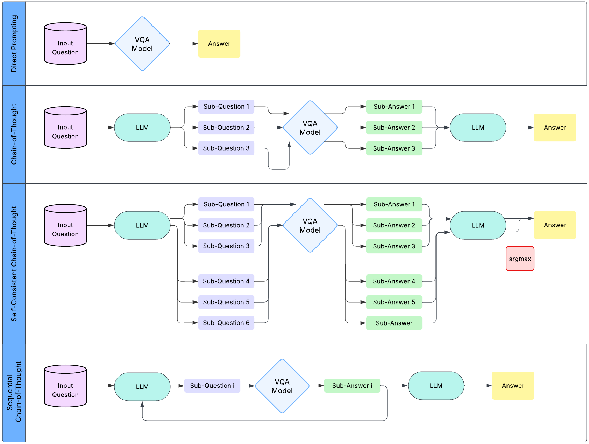

## Description
An exploration of dynamic Chain-of-Thought sub-question generation methods for Visual Question Answering (VQA). Course final project for CPSC 477/577 Natural Language Processing (Spring 2025).

## Author
Phuc Duong, Sophia Kang, Eric Wang

CPSC 477/577: Natural Language Processing, Spring 2025

Yale University, Department of Computer Science

## Overview

The Visual Question Answering (VQA) task is difficult for vision-language and language models because it requires answering questions that involve not only multimodal inputs but also multiple reasoning steps. We introduce 3 new systems for CoT for VQA: (1) dynamic CoT, which generates sub-questions tailored to each image-question pair, (2) self-consistent CoT, which samples multiple reasoning chains and picks the most frequent answer, and (3) sequential CoT which feeds in the answer to a sub-question back into the model, before generating a new one to iteratively develop further sub-questions. We found that sequential CoT performed 10.59\% better compared to basic CoT in BLIP-2+GPT4.1 and 36.6\% better with VILT+o4-mini. Analysis also shows that sequential prompting can help correct hallucinations and mitigate error propagation to some questions. Additionally, we also found that CoT prompting is explicitly better on questions that compare attributes of two different objects, as it isolates each attribute into simpler sub-questions the VQA model can answer more accurately. Our results show that iterative and dynamic reasoning with CoT can help improve multi-step VQA.



## Setup and Computing Infrastructure

**Frameworks Version**
- Python 3.11.11
- Pytorch 2.5.1+cu121
- Datasets 3.5.0
- Tokenizers 0.21.1

**Hardware**
- Red Hat Enterprise Linux OS
- 6 Intel Xeon Gold 6326 CPU with 36 CPU cores
- 128 GB of RAM

A full list of the dependencies can be found in
`requirements.txt`.

To install the dependencies, please do the following command in the root directory `vqa-cot`.
```bash
pip install e .
pip install -r requirements.txt
```

**Environmental Variables**
Ensure you have a `.env` file with the following API keys
```bash
OPENAI_API_KEY=<key>
HF_API_KEY=<key>
```

## Data preprocessing

We utilized the GQA: Visual Reasoning in the Real World dataset. The data can be downloaded [here](https://cs.stanford.edu/people/dorarad/gqa/about.html). All data preprocessing code can be found [data_preprocess.py](data/data_preprocess.py). 

### Overview
We first flattened the GQA data and used stratified sampling by local group to ensure that the selected questions were representative of the various types and scenarios found in the full dataset. Then we created different processing functions, `preprocess_data_classification` and `preprocess_data_generation,` that handle the data preparation for our classification and generation tasks, respectively.

- Classification encodes answers as one-hot vectors
- Generation function formats input as question-answer prompts with appropriate token masking

### Running script
`preprocess_data_classification` and `preprocess_data_generation` are meant to be used with `map` to process the data. However, to flatten the data and prepare it for use by those functions, you can run `data_preprocess.py`. An example of a slurm script can be found in [scripts/preproc_gqa_data](scripts/preproc_gqa_data.sh) and below.

```bash
python data/data_preprocess.py \
  --train_data_path "data/questions/train_balanced_questions.json" \
  --test_data_path "data/questions/testdev_balanced_questions.json" \
  --val_data_path "data/questions/val_balanced_questions.json" \
  --k_train 40000 \
  --k_test 5000 \
  --k_val 5000 \
  --process_train \
  --process_test \
  --process_val
```

### Arguments
| Argument                                                                  | Type    | Description                                                                                                                   
|----------------------------------------------------------------------------|---------|-------------------------------------------------------------------------------------------------------------------------------------------------------------|
| `--train_data_path`                                                       | str     | **Required.** Glob pattern for training data.                                                                                                               |
| `--val_data_path`                                                         | str     | **Required.** Glob pattern for validation data.                                                                                                             |
| `--test_data_path`                                                        | str     | **Required.** Glob pattern for test data.                                                                                                                   |
| `--output_train_dir` `--output_val_dir` `--output_test_dir`          | str     | Output paths for processed data. Defaults: `data/gqa_flat_train.json` `data/gqa_flat_val.json` `data/gqa_flat_test.json`.                     |
| `--k_train` `--k_val` `--k_test`                                    | int     | Limit datasets to `k` elements (no limit if -1). Defaults: `-1`.                                                                                            |
| `--process_train` `--process_val` `--process_test`                  | flag    | Specify which dataset(s) to process.                                                                                                                        |
## Model

We used a pre-trained [`Salesforce/blip2-opt-2.7b`](https://huggingface.co/Salesforce/blip2-opt-2.7b) and [`dandelin/vilt-b32-mlm`](https://huggingface.co/dandelin/vilt-b32-mlm), implemented in [blip_model.py](model/blip_model.py) and [vilt_model.py](model/vilt_model.py). Our model code are built to interface with Hugging Face transformers. If using a custom model, please make sure it's compatible with Hugging Face libraries and that it implements `train` or `forward` following the `Model` class in [base_model.py](model/base_model.py) for integration into our evaluation system. Our trained model is available at [`phucd/vilt-gqa-ft`](https://huggingface.co/phucd/vilt-gqa-ft).


LLM models used for evaluation are `gpt-4.1-2025-04-14` and `o4-mini-2025-04-16`.


## Training

### Training Parameters
Training parameters can be found and configured in the respective models' file in the `train()` function under `TrainingArguments`.

### Running script
To train a supported-model (BLIP2, VILT) use the script [train.py](train.py). An example slurm script can be found in [scripts/train_blip.sh](scripts/train_blip.sh) and below.

```bash
python train.py \
    --image_dir data/images/images \
    --train_data_dir data/gqa_flat_train.json \
    --val_data_dir data/gqa_flat_val.json \
    --output_dir saved_models/blip-gqa-ft2 \
    --model_type blip
```


### Arguments

| Argument                                                       | Type    | Description                                                                                                                                              |
|----------------------------------------------------------------|---------|----------------------------------------------------------------------------------------------------------------------------------------------------------|
| `--image_dir`                                                  | str     | **Required.** Directory containing the images.                                                                                                           |
| `--train_data_dir`                                             | str     | **Required.** Path to the preprocessed training data JSON.                                                                                               |
| `--val_data_dir`                                               | str     | **Required.** Path to the preprocessed validation data JSON.                                                                                             |
| `--model_type`                                                 | str     | **Required.** VQA model type, must be one of `vilt` or `blip`.                                                                                           |
| `--output_dir`                                                 | str     | Output directory for the fine-tuned model. Default: `vilt-finetuned`.                                                                                    |
| `--model_dir`                                                  | str     | (Optional) Custom directory for loading a model checkpoint.                                                                                              |
| `--base_model_name`                                            | str     | (Optional) Base model name for the processor (e.g., `dandelin/vilt-b32-mlm`).                                                                            |

- If `--model_dir` is not provided, the script defaults to the standard models:
    - `vilt`: `dandelin/vilt-b32-mlm`
    - `blip`: `Salesforce/blip2-opt-2.7b`
    - Can either take hugging face model's name, or locally saved models.
- `--base_model_name` can be used to override the processor base model.


## Evaluation

### System & Evaluation

The four systems' (Direct Prompting, CoT, Consistent CoT, Sequential CoT) implementation can be found in [eval.py](eval.py) along with the evaluation loop that evaluates the model's performance.
### Sub-Questions Generation

- Sub-questions generation code can be found in [cot/llm_prompt.py](cot/llm_prompt.py) with the associated prompts for each system and aggregation found in `cot/prompts`. 
- Each folder will have a prompt given to the model as a `user` and a system prompt given to direct the model as a `system`. 
    - **System prompts** are instructions and guidance on how to generate the sub-questions.
    - **Prompts** provides the visual complex question the LLMs break down/answer and also the total aggregation of sub-questions if it's the aggregation prompt to get the final answer.


### Running script

Example to run evaluation with BLIP2 and Chain-of-Thought prompting:

```bash
python eval.py \
    --model_type blip \
    --model_dir Salesforce/blip2-opt-2.7b \
    --eval_dataset_path data/250_gqa_test.json \
    --prompting_mode cot \
    --output_dir results/gpt4.1_cot_blip_250.json \
    --image_dir data/images/images \
    --openai_model_name gpt-4.1-2025-04-14
```

Example with CoT Sequential prompting:

```bash
python eval.py \
    --model_type blip \
    --model_dir Salesforce/blip2-opt-2.7b \
    --eval_dataset_path data/250_gqa_test.json \
    --prompting_mode cot-sequential \
    --output_dir results/gpt4.1_sequential_blip_250.json \
    --image_dir data/images/images \
    --openai_model_name gpt-4.1-2025-04-14
```

Example with CoT Consistent prompting:

```bash
python eval.py \
    --model_type blip \
    --model_dir Salesforce/blip2-opt-2.7b \
    --eval_dataset_path data/250_gqa_test.json \
    --prompting_mode cot-consistent \
    --output_dir results/gpt4.1_consistent_blip_250.json \
    --image_dir data/images/images \
    --openai_model_name gpt-4.1-2025-04-14
```

### Arguments

| Argument                                                         | Type    | Description                                                                                                                                                        |
|-------------------------------------------------------------------|---------|--------------------------------------------------------------------------------------------------------------------------------------------------------------------|
| `--prompting_mode`                                               | str     | **Required.** Prompting strategy: one of `direct`, `cot`, `cot-consistent`, `cot-sequential`.                                                                      |
| `--eval_dataset_path`                                            | str     | Path to the evaluation dataset.                                                                                                                                    |
| `--output_dir`                                                   | str     | Output directory for results. Default: `../eval_output/eval_results.json`.                                                                                         |
| `--openai_model_name`                                            | str     | OpenAI model name for aggregation of sub-questions and CoT. Default: `gpt-4.1-2025-04-14`.                                                                                   |
| `--model_type`                                                   | str     | **Required.** VQA model type: `vilt` or `blip`.                                                                                                                    |
| `--model_dir`                                                    | str     | (Optional) Custom model directory to load a specific checkpoint.                                                                                                   |
| `--image_dir`                                                    | str     | **Required.** Directory containing the images.                                                                                                                     |
### Results

The results we discussed in our papers can be found in `results`. 
They include the following:

| Field                    | Description                                                                                                   |
|--------------------------|---------------------------------------------------------------------------------------------------------------|
| **test_type**            | The prompting type used (e.g., `Direct`, `COT`, etc.).                                                        |
| **openai_model_name**    | The LLM used for Chain-of-Thought prompting.                                                                  |
| **model_dir**            | The vision model used for evaluation (e.g., `Salesforce/blip2-opt-2.7b`).                                     |
| **accuracy**             | Overall accuracy `correct/total`.                                                               |
| **correct_count**        | The number of questions where the model prediction matched the expected answer.                               |
| **total_count**          | The total number of evaluated questions.                                                                      |
| **results**              | A list of per-question results, each with the following fields:                                               |
| - question   | The question from the dataset.                                                                                |
| - image_path | The path to the image associated with the question.                                                           |
| - qa_pairs   | Sub-questions generated by the LLM and the corresponding answers from the vision model.                       |
| **expected_answer**      | The expected (ground truth) answer.                                                                           |
| **model_prediction**     | The model's predicted answer—either from the vision model (direct) or LLM aggregation (COT modes).            |
| **is_correct**           | Boolean indicating whether the prediction matches the expected answer.                                        |


## References

1. **Stanislaw Antol**, Aishwarya Agrawal, Jiasen Lu, Margaret Mitchell, Dhruv Batra, C. Lawrence Zitnick, and Devi Parikh.  
   *VQA: Visual Question Answering.*  
   *In 2015 IEEE International Conference on Computer Vision (ICCV), pages 2425–2433, 2015.*

2. **Rui Cao** and Jing Jiang.  
   *Knowledge generation for zero-shot knowledge-based VQA.*  
   *Findings of the Association for Computational Linguistics: EACL 2024, pages 533–549, St. Julian’s, Malta, March 2024.*

3. **Zhenfang Chen**, Qinhong Zhou, Yikang Shen, Yining Hong, Zhiqing Sun, Dan Gutfreund, and Chuang Gan.  
   *Visual Chain-of-Thought Prompting for Knowledge-Based Visual Reasoning.*  
   *Volume 38, pages 1254–1262, March 2024.*

4. **Drew A. Hudson** and Christopher D. Manning.  
   *GQA: A new dataset for real-world visual reasoning and compositional question answering.*  
   *In CVPR, June 2019.*

5. **Wonjae Kim**, Bokyung Son, and Ildoo Kim.  
   *VILT: Vision-and-language transformer without convolution or region supervision.*  
   *In ICML, volume 139 of Proceedings of Machine Learning Research, pages 5583–5594, July 2021.*

6. **Guangyao Li**, Henghui Du, and Di Hu.  
   *AVQA-CoT: When CoT Meets Question Answering in Audio-Visual Scenarios.*  
   *In CVPR Sight and Sound Workshops, 2024.*

7. **Junnan Li**, Dongxu Li, Caiming Xiong, and Steven Hoi.  
   *BLIP: Bootstrapping language-image pre-training for unified vision-language understanding and generation.*  
   *In ICML, 2022.*

8. **Pan Lu**, Swaroop Mishra, Tony Xia, Liang Qiu, Kai-Wei Chang, Song-Chun Zhu, Oyvind Tafjord, Peter Clark, and Ashwin Kalyan.  
   *Learn to Explain: Multimodal Reasoning via Thought Chains for Science Question Answering.*  
   *In NeurIPS, 2022.*

9. **OpenAI.**  
   *GPT-4o mini: Advancing Cost-Efficient Intelligence,* July 2024.

10. **OpenAI.**  
    *Introducing GPT-4.1,* 2025.

11. **Hao Shao**, Shengju Qian, Han Xiao, Guanglu Song, Zhuofan Zong, Letian Wang, Yu Liu, and Hongsheng Li.  
    *Visual CoT: Advancing Multi-Modal Language Models with a Comprehensive Dataset and Benchmark for Chain-of-Thought Reasoning.*  
    *In NeurIPS, volume 37, pages 8612–8642, 2024.*

12. **Kohei Uehara**, Nan Duan, and Tatsuya Harada.  
    *Learning to ask informative sub-questions for visual question answering.*  
    *In CVPR Workshops (CVPRW), pages 4680–4689, 2022.*

13. **Ruonan Wang**, Yuxi Qian, Fangxiang Feng, Xiaojie Wang, and Huixing Jiang.  
    *Co-VQA: Answering by Interactive Sub Question Sequence.*  
    *In ACL 2022 Findings, pages 2396–2408, Dublin, Ireland, May 2022.*

14. **Xuezhi Wang**, Jason Wei, Dale Schuurmans, Quoc Le, Ed Chi, Sharan Narang, Aakanksha Chowdhery, and Denny Zhou.  
    *Self-Consistency Improves Chain of Thought Reasoning in Language Models,* 2023.
